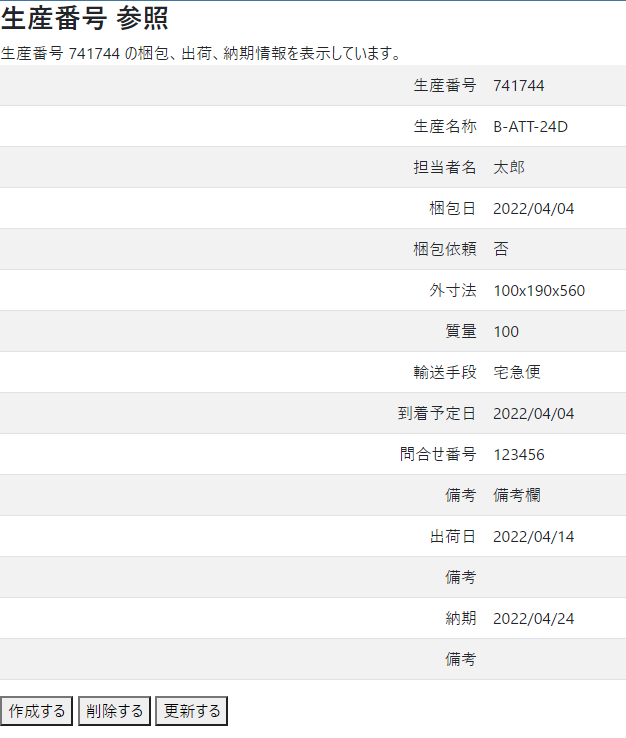

製品出荷管理CRUD APIサーバー

* 梱包
* 出荷
* 納期

の日付等のデータをJSONに保存し、操作するAPIを提供します。

## Quick Start
1. schd を実行する
1. ブラウザアドレス欄に http://localhost:8080/api/v1/view/list を打ち込み、テーブル表示を確認する。
1. view/listで表示されるリンクをクリックし 、生産番号の情報を確認する。

1. [ 作成する ]ボタンをクリックし、作成フォームを表示させる。

1. 作成したい情報を入力し、[ 作成 ]ボタンをクリックする。

1. [ 更新する ] ボタンをクリックし、更新フォームへ移動する。
1. 更新したい情報を入力し、[ 更新 ]ボタンをクリックし、リンク先にて更新内容を確認する。

1. [ 削除 ]ボタンをクリックし、確認用のポップアップに対してOKをクリックする。

## API
1. ブラウザアドレス欄に http://localhost:8080/api/v1/data/list を打ち込み、JSONを確認する。
1. ブラウザアドレス欄に http://localhost:8080/api/v1/data/cal を打ち込み、JSONを確認する。
1. ブラウザアドレス欄に http://localhost:8080/api/v1/data を打ち込み、JSONを確認する。 このJSONはtest/sample.json の中身と同一。
1. ブラウザアドレス欄に http://localhost:8080/api/v1/data/741744 を打ち込み、JSONを確認する。
このJSONはtest/sample.json の中身のキー=741744 オブジェクトと同一。
また、http://localhost:8080/api/v1/view/list に表示されるリンクの遷移先。

## API

| 説明 | メソッド | URI | パラメータ | 使用例 |
|----|------|-----|-------|-------|
| 保存されているJSONの中身を出力 | GET | /api/v1/data |  数字 | curl "localhost:8080/api/v1/data/000000" |
| JSONからデータの登録 | POST | /api/v1/data/add |  数字 | curl -X POST "localhost:8080/api/v1/data/add" -H 'content-type: application/json' -T test /post.json |
| JSONからデータの更新 | PUT | /api/v1/data |  数字 | curl -X PUT "localhost:8080/api/v1/data/000000" -H 'content-type: application/json' -T test/put.json |
| データの削除 | DELETE | /api/v1/data |  数字 | curl -X DELETE "localhost:8080/api/v1/data/000000" |
| Cal構造体から日付をプライマリキーとするテーブル形式のRowsをJSONで返す | GET | /api/v1/data/list |  なし |  http://localhost:8080/data/list |
| Cal構造体から日付をプライマリキーとするテーブル形式のRowsをHTMLで返す | GET | /api/v1/view/list |  なし |  http://localhost:8080/view/list |

